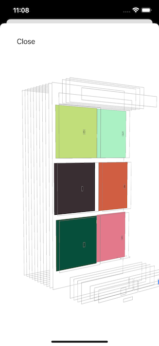
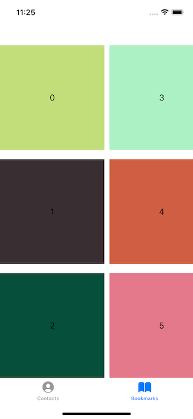
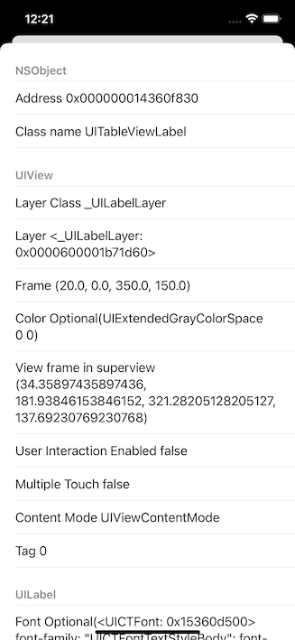
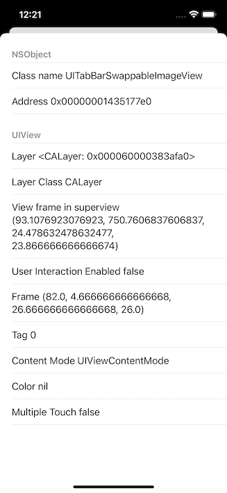

# Glance

### Glance is lightweight library that allows you debug view hierarchy right from you mobile device or simulator


 

## Installation

### Swift Package Manager

```
dependencies: [
    .package(url: "https://github.com/nikitabelopotapov/Glance.git", .upToNextMajor(from: "0.0.1"))
]
```


## Usage

 Suggested use-case is to attach Glance to shake gesture in UIWindow extension

```
import Glance

extension UIWindow {
    open override func motionEnded(_ motion: UIEvent.EventSubtype, with event: UIEvent?) {
        super.motionEnded(motion, with: event)
        if motion == .motionShake {
            Glance.main.debug(view: self)
        }
    }
}
```

## Custom views

In order you have any custom or not supported view (such as view that drows in content in CGContext), you can provide custom.

```
final class CustomLayoutProvider: LayoutProvidable {
    var layoutMapper: LayoutMappable?
    
    func provide(for view: UIView, depth: inout Float, masterView: UIView?) -> [LayoutSnapshot] {
        return [LayoutSnapshot(image: UIImage(), depth: 1, frame: .zero, view: view)]
    }
}
```

And then add it to Glance layout providers

```
@main
class AppDelegate: UIResponder, UIApplicationDelegate {

	func application(_ application: UIApplication, didFinishLaunchingWithOptions launchOptions: [UIApplication.LaunchOptionsKey: Any]?) -> Bool {
        Glance.main.addLayoutProvider(provider: CustomLayoutProvider(), viewClass: MyCustomClass.Type)
		return true
	}
}
```

## View properties (Beta)

 

By tapping any view in Glance main screen you can inspect view properties.
`Now this feature is not fully implemented.`

## Contributing

### Feel free to open Pull request or issue
